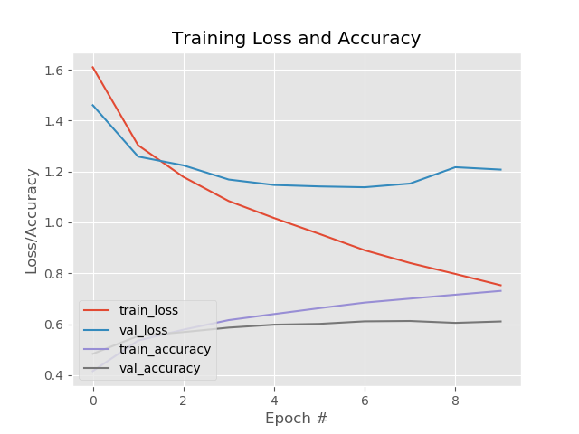

# Keras-ImgClassification
Image Classification with CIFAR10 dataset, you can use your own dataset if u want

Requirements
1. keras == 2.3.0 (conda install -c conda-forge keras)
2. opencv == 4.4.0.44 (pip install opencv-python)
3. imutils == 0.5.3 (pip install imutils) // Module made by pyimagesearch , great website for ML : https://www.pyimagesearch.com/
4. matplotlib == 3.3.2 (pip install matplotlib)
5. sklearn == 0.23.2 (pip install sklearn)

How to Run:

1. Dataset Preparation:
-Download the following dataset and create a folder name "data"
-Put the "cifar10png" file inside the "data" folder
https://drive.google.com/file/d/1d666e1DLtlAKk9D_P-aVkRB9P-jSV9AT/view?usp=

Folder Arch:

        Ldata
          Lcifar10png
        train.py

2. Run train.py

Traing Result:

Details of the code:(TBW)

Check train.py to see the details of the LeNet5

        model.add(Conv2D(filters=6, kernel_size=(5, 5), strides=(1, 1), padding='valid', activation='relu', input_shape=                        (32,32,3)))
        
        model.add(MaxPooling2D(pool_size=(2, 2), strides=(2, 2) , padding='valid'))

        model.add(Conv2D(filters=16, kernel_size=(5, 5), strides=(1, 1), padding='valid', activation='relu'))
        model.add(MaxPooling2D(pool_size=(2, 2), strides=(2, 2) ,padding='valid'))

        model.add(Flatten())

        model.add(Dense(units=120, activation='relu'))

        model.add(Dense(units=84, activation='relu'))

        model.add(Dense(units=10, activation = 'softmax'))
